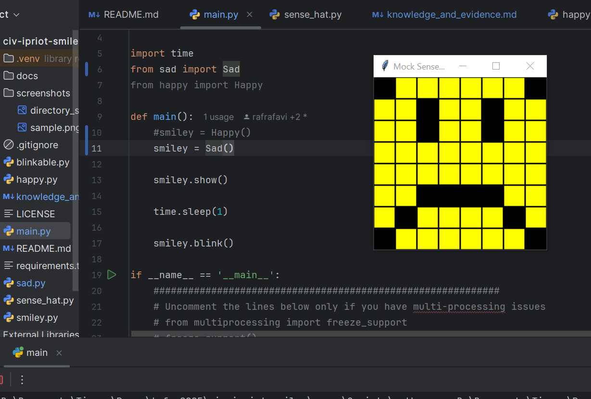
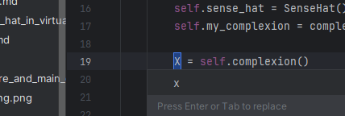

# Evidence and Knowledge

This document includes instructions and knowledge questions that must be completed to receive a *Competent* grade on this portfolio task.

## 1. Required evidence

### 1.1. Answer all questions in this document

- Each answer should be complete, well-articulated, and within the specified word count limits (if added) for each question.
- Please make sure **all** external sources are properly cited.
- You must **use your own words**. Please include your full chat transcripts if you use generative AI in any way.
- Generative AI hallucinates, is not an authoritative source

### 1.2. Make all the required modifications to the code

- Please follow the instructions in this document to make the changes needed to the code.

- When requested to upload evidence, upload all screenshots to `screenshots/` and embed them in this document. For example:

```markdown

```


> Note the `!`, and the use of a relative path.

- You must upload the code into your GitHub repository.
- While you can use a branch, your code should be in main when you submit.
- Upload a zip of this repository to Blackboard when you are ready to submit.
- You will be notified of your result via Blackboard
- However, if using GitHub classrooms, you may also receive additional feedback on GitHub directly

### 1.3. Optional: Use of Raspberry Pi and SenseHat

Raspberry Pi or SenseHat is **optional** for this activity. You can use the included `sense_hat.py` file to simulate the SenseHat on your computer.

If you use a Pi, please **delete** the `sense_hat.py` file.

### 1.4. Accessible version of the code

This project relies on visual patterns that appear on an LED matrix. If you have any accessibility requirements, you can use the `udl/accessible` branch to complete the project. This branch provides an accessible code version that uses text-based patterns instead of visual ones.

Please discuss this with your lecturer before using that branch.

## 2. Specific Tasks & Questions

Address the following tasks and questions based on the code provided in this repository.

### 2.1. Set up the project locally

1. Fork this repository (if not using GitHub Classrooms)
2. Clone your repository locally
3. Run the project locally by executing the `main.py` file
4. Evidence this by providing screenshots of the project directory structure and the output of the `main.py` file


If you are running on a Raspberry Pi, you can use the following command to run the project and then screenshot the result:

```bash
ls
python3 main.py
```

### 2.2. Fundamental code comprehension

 Answer each of the following questions **as they relate to that code** supplied by in this repository (ignore `sense_hat.py`):

1. Examine the code for the `smiley.py` file and provide  an example of a variable of each of the following types and their corresponding values (`_` should be replaced with the appropriate values):

   | Type                    | name   | value           |
   | ----------              |--------|-----------------|
   | built-in primitive type | dimmed | True            |
   | built-in composite type | WHITE  | (255, 255, 255) |
   | user-defined type       | Smiley | None            |

2. Fill in (`_`) the following table based on the code in `smiley.py`:

   | Object                   | Type                    |
   | ------------             | ----------------------- |
   | self.pixels              | built-in composite type |
   | A member of self.pixels  | built-in composite type |
   | self                     | user-defined            |

3. Examine the code for `smiley.py`, `sad.py`, and `happy.py`. Give an example of each of the following control structures using an example from **each** of these files. Include the first line and the line range:

   | Control Flow | File     | First line                      | Line range |
   | ------------ |----------|---------------------------------|------------|
   |  sequence    | happy.py | self.draw_eyes(wide_open=False) | 39-43      |
   |  selection   | sad.py   | if wide_open:                   | 26-29      |
   |  iteration   | happy.py | for pixel in mouth:             | 21-22      |

4. Though everything in Python is an object, it is sometimes said to have four "primitive" types. Examining the three files `smiley.py`, `sad.py`, and `happy.py`, identify which of the following types are used in any of these files, and give an example of each (use an example from the code, if applicable, otherwise provide an example of your own):

   | Type  | Used? | Example                                                    |
   |-------|-------|------------------------------------------------------------|
   | int   | yes   | for pixel in mouth:                                        | ##'pixel' is assigned values from 'mouth' which is a list of integers.
   |       |       |   self.pixels[pixel] = self.BLANK                          |  
   | float | yes   | delay=0.25                                                 |
   | str   | no    | example_ = 'This is an example of the primitive type: str' |
   | bool  | yes   | wide_open=False                                            |

5. Examining `smiley.py`, provide an example of a class variable and an instance variable (attribute). Explain **why** one is defined as a class variable and the other as an instance variable.

> Class example: class Smiley
> Instance example: Y = self.YELLOW
> Explanation:
> A **class variable** stores a value that is the same across every object created from that class.  
> The first example provided displays 'Smiley' a variable used to share a common value across all instances of itself.
> 
> An **instance variable** is defined inside a class and is exclusive to each instance of that class.
> In the second example provided, an instance variable is used for encapsulation by bundling 'self.YELLOW' with a single character, 'Y'. 
> This helps to keep the data organized and readable. 

6. Examine `happy.py`, and identify the constructor (initializer) for the `Happy` class:
   1. What is the purpose of a constructor (in general) and this one (in particular)?

   > The purpose of a constructor is to initialize the instance variables of a class when it is created. And to make sure every object 
   > starts with specific value or a setup logic. In the specific case of the `def __init__(self)` constructor present in `happy.py`, its purpose is to setup rendering logic.
   > 

   2. What statement(s) does it execute (consider the `super` call), and what is the result?

   > The `def __init__(self)` constructor calls the methods `self.draw_mouth()`, `self.draw_eyes()`, as well as the constructor `super().__init__()`. 
   > Which are responsible for initializing the parent classes and rendering the mouth and eyes.
   >

### 2.3. Code style

1. What code style is used in the code? Is it likely to be the same as the code style used in the SenseHat? Give to reasons as to why/why not:

> The code style used is PEP8. And yes, the class `SenseHat` uses the same code style. As the code is formatted in a mannerism that fits within the constraints
> of the PEP8 conventions. 
>

2. List three aspects of this convention you see applied in the code.

> a) Consistent indentation
> b) Clear separation of methods and
> c) Naming standards that follow standard PEP8 naming conventions.
>

3. Give two examples of organizational documentation in the code. 

> Example one: 
> """Mock SenseHAT class. If you have access to a SenseHAT (either via a Raspberry Pi or a SenseHAT emulator), you can use the real SenseHAT class instead of this one.)
    To do that DELETE this file so that it will not shadow the sense_hat class installed in your system.
    You do not need to understand this code to use it for the smiley exercise"""

> Example two: 
>   ############################################################
    # Uncomment the lines below only if you have multi-processing issues
    # from multiprocessing import freeze_support
    # freeze_support()
    ############################################################

### 2.4. Identifying and understanding classes

> Note: Ignore the `sense_hat.py` file when answering the questions below

1. List all the classes you identified in the project. Indicate which classes are base classes and which are subclasses. For subclasses, identify all direct base classes.
  
  Use the following table for your answers:

| Class Name | Super or Sub? | Direct parent(s)  |
|------------|---------------|-------------------|
| Blinkable  | Super         |                   |
| Happy      | Sub           | Smiley, Blinkable |
| Sad        | Sub           | Smiley            |
| Smiley     | Super         |                   |

2. Explain the concept of abstraction, giving an example from the project (note "implementing an ABC" is **not** in itself an example of abstraction). (Max 150 words)

> Explanation: Abstraction is the process of tucking away implementation information, keeping only features that are essential and relevant to external sources. All for the purpose of making complex systems and data types easier and safer to use. 

> Example: blink()

3. What is the name of the process of deriving from base classes? What is its purpose in this project? (Max 150 words)

> When you derive from a base class it's called 'Inheritance'. Its purpose in the project is to allow subclasses , like Happy() and/or Sad(), to inherit variables and methods from base classes, like Blinkable(), Smiley() and/or SenseHat().

### 2.5. Compare and contrast classes

Compare and contrast the classes Happy and Sad.

1. What is the key difference between the two classes?
   > Different:
   >    1. The method draw_eyes(), inside Sad, has flawed logic.
   >    2. Happy inherits from Blinkable 
   >    3. There is no blink() method in Sad
   >    4. The value for the variable 'mouth' differs.
   
2. What are the key similarities?
   > Both are subclasses
   > They both inherit from Smiley
   > Both have a draw_eyes() and draw_mouth() method.
    
3. What difference stands out the most to you and why?
   > The flawed method draw_eyes(), inside Sad. It overwrites the value of eyes[]
   > inside the loop, and causes it to become a tuple. 
   > This causes line 25, 'for pixel in eyes:', to become invalid after the first iteration. 
   > Ultimately breaking the loop.
   > 
   > Whereas the method draw_eyes() in Happy runs smoothly. Iterating over the eyes[] list and setting 
   > each corresponding pixel to the correct colour value based on the condition.

4. How does this difference affect the functionality of these classes
   > The broken draw_eyes() method in Sad will result in an error not long after it's called.   
   > Whilst the fully functional draw_eyes() method inside Happy will run as intended, without any issues.

### 2.6. Where is the Sense(Hat) in the code?

1. Which class(es) utilize the functionality of the SenseHat?
   > The classes that utilize the functionality of the SenseHat are Smiley and Happy. 
   >
2. Which of these classes directly interact with the SenseHat functionalities?
   > Smiley is the class that directly interacts with the SenseHat functionalities.
   >
3. Discuss the hiding of the SenseHAT in terms of encapsulation (100-200 Words)
   > In Smiley, the instance attribute 'self.sense_hat' is assigned the base class 'SenseHat'.
   > This action gives controlled access to 'SenseHat'. Using public methods as intermediaries 
   > to get and set data and restricting direct access to data that is declared private. 
   > This process prevents external code from accidentally or intentionally making modifications. 
   > Ensuring the integrity of the data. 
   > Case in point is '_set_pixels()', a private method in 'SenseHat' that has 12 lines of code that 
   > are used to set the rgb value of each pixel displayed. To maintain the integrity of the data,
   > the way to access this method is through the public setter method 'set_pixel()', which emulates the
   > original code.
   >

### 2.7. Sad Smileys Can’t Blink (Or Can They?)

Unlike the `Happy` smiley, the current implementation of the `Sad` smiley does not possess the ability to blink. Let's first explore how blinking has been implemented in the Happy Smiley by examining the blink() method, which takes one argument that determines the duration of the blink.

**Understanding Blink Mechanism:**

1. Does the code's author believe that every `Smiley` should be able to blink? Explain.

> Yes, because the author set up the blink feature with an abstract class which suggests that the author intended to share amongst multiple classes. 

2. For those smileys that blink, does the author expect them to blink in the same way? Explain.

> For the `Happy` smileys, The author expects them to blink with a small delay applied beforehand. 
>

3. Referring to the implementation of blink in the Happy and Sad Smiley classes, give a brief explanation of what polymorphism is.

> In OOP it allows objects of a different class to handled as objects of a common base class.
> And, Within the context of the Happy and Sad Smiley classes, polymorphism is achieved through
> method overriding using the inherited base class/es `Smiley` and `Blinkable`. 
> Through inheritance the subclasses Happy and Sad Smiley classes are able to modify objects
> of the inherited base class/es.

4. How is inheritance used in the blink method, and why is it important for polymorphism?
> Inheritance allows the 'Sad' class to inherit the interface from the base class 'Blinkable'.
> This is important for polymorphism because it lets other parts of the project treat all 'Blinkable' objects
> the same way, even if they are instances of a different subclass. And, through the use of polymorphism the 'blink' method will be called automatically, depending on the object's type.

**Implement Blink in Sad Class:**

   - Create a new method called `blink` within the Sad class. Ensure you use the same method signature as in the Happy class:

   ```python
    def blink(self, delay=0.25):
        self.draw_eyes(wide_open=False)
        self.show()
        time.sleep(delay)
        self.draw_eyes(wide_open=True)
        self.show()
   ```

1. **Code Implementation:** Implement the code that allows the Sad smiley to blink. Use the implementation from the Happy Smiley as a reference. Ensure your new method functions similarly by controlling the blink duration through the `delay` argument.

2. **Testing the Implementation:**

- Test the new blink functionality on your Raspberry Pi or within the Python classes provided. You might need to adjust the `main.py` script to incorporate Sad Smiley's new blinking capability.

Include a screenshot of the sad smiley or the modified `main.py`:



- Observe and document the Sad smiley as it blinks its eyes. Describe any adjustments or issues encountered during implementation.

  > I mistakenly wrote the method before importing 'time' which cause a minor issue with the statement 'time.sleep(delay)' due to this order of operations. Easily fixed by deleting and re-writing the statement after importing 'time'. 

  ### 2.8. If It Walks Like a Duck…

  Previously, you implemented the blink functionality for the Sad smiley without utilizing the class `Blinkable`. Assuming you did not use `Blinkable` (even if you actually did), consider how the Sad smiley could blink similarly to the Happy smiley without this specific class.

  1. **Class Type Analysis:** What kind of class is `Blinkable`? Inspect its superclass for clues about its classification.

  > `Blinkable` is an Abstract Class.

  2. **Class Implementation:** `Blinkable` is a class intended to be implemented by other classes. What generic term describes this kind of class, which is designed for implementation by others? **Clue**: Notice the lack of any concrete implementation and the naming convention.

  > A class intended to be implemented by other classes is called a Base class.

  3. **OO Principle Identification:** Regarding your answer to question (2), which Object-Oriented (OO) principle does this represent? Choose from the following and justify your answer in 1-2 sentences: Abstraction, Polymorphism, Inheritance, Encapsulation.

  > The Object-Oriented (OO) principle represented is Inheritance.
  > This is because base classes are a class designed to be inherited, to be implemented by other classes and to define shared behaviours and interfaces.  

  4. **Implementation Flexibility:** Explain why you could grant the Sad Smiley a blinking feature similar to the Happy Smiley's implementation, even without directly using `Blinkable`.

  > The blinking feature works without directly inheriting from `Blinkable` because `Blinkable` is an abstract class designed to enforce structure, not enable functionality. Which, whist it's good practice, is not necessary for the feature to run since dynamic languages like python emphasize more on an objects behaviour over its type or class. So, as long as the blink() method exists and works as expected, the feature will function correctly, regardless of whether 'Blinkable' is used.

  5. **Concept and Language Specificity:** In relation to your response to question (4), what is this capability known as, and why is it feasible in Python and many other dynamically typed languages but not in most statically typed programming languages like C#? **Clue** This concept is hinted at in the title of this section.

  > The capability is known as 'Duck Typing'. And, the reason it's not feasible in most statically typed programming languages is because, unlike Python that type checks during runtime, type checks for languages like C# happen at compile time. So, even if an object has the correct behaviour, it has to directly inherit from or implement a specific type or interface, otherwise the code won't compile.

  ***

  ## 3. Refactoring

  ### 3.1. Does a Smiley Have to Be Yellow?

  While our current implementation predominantly features yellow smileys, emotional expressions like sickness or anger typically utilize colors like green, red, or orange. We'll explore the feasibility of integrating these colors into our smileys.

  1. **Defined Colors and Their Location:**

     1. Which colors are defined and in which class(s)?
        >  In the Smiley class the colours white, green, red, yellow and blank are defined.
     2. What type of variables hold these colors? Are the values expected to change during the program's execution? Explain your answer.
        > These colours hold variables of type 'Tuple' meaning they won't change during execution, as tuples are unchangeable after they're created.
     3. Add the color blue to the appropriate class using the appropriate format and values.
  
  2. **Usage of Color Variables:**

     1. In which classes are the color variables used?
        > Classes using color variables include: Smiley, Sad, Happy

  3. **Simple Method to Change Colors:**
  4. What is the easiest way you can think to change the smileys to green? Easiest, not necessarily the best!
     > YELLOW = GREEN

  Here's a revised version of the "Flexible Colors – Step 1" section for the smiley project, incorporating your specifications for formatting and content updates:

  ### 3.2. Flexible Colors – Step 1

  Changing the color of the smileys once is straightforward, but it isn't very flexible. To facilitate various colors for smileys, it is advisable not to hardcode values in any class. This approach was identified earlier as a necessary change. Let's start by removing the built-in assumptions about color in our classes.

  1. **Add a method called `complexion` to the `Smiley` class:** Implement this instance method to return `self.YELLOW`. Using the term "complexion" instead of "color" provides a more abstract terminology that focuses on the meaning rather than implementation.

  2. **Refactor subclasses to use the `complexion` method:** Modify any subclass that directly accesses the color variable to instead utilize the new `complexion` method. This ensures that color handling is centralized and can be easily modified in the future.

  3. **Determine the applicable Object-Oriented principle:** Consider whether Abstraction, Polymorphism, Inheritance, or Encapsulation best applies to the modifications made in this step. [I do NOT have the brain for this Q right now]

  4. **Verify the implementation:** Ensure that the modifications function as expected. The smileys should still display in yellow, confirming that the new method correctly replaces the direct color references.

  This step is crucial for setting up a more flexible system for color management in the smiley display logic, allowing for easy adjustments and extensions in the future.

  ### 3.3. Flexible Colors – Step 2

  Having removed the hardcoded color values, we now enhance the base class to support dynamic color assignments more effectively.

  1. **Modify the `__init__()` method in the `Smiley` class:** Introduce a default argument named `complexion` and assign `YELLOW` as its default value. This allows the instantiation of smileys with customizable colors.

  2. **Introduce a new instance variable:** Create a variable called `my_complexion` and assign the `complexion` parameter to it. This step ensures that each smiley instance can maintain its own color state.

  3. **Rationale for `my_complexion`:** Using a distinct instance variable like `my_complexion` avoids potential conflicts with the method parameter names and clarifies that it is an attribute specific to the object.

  4. **Bulk rename:** We want to update our grid to use the value of complexion, but we have so many `Y`'s in the grid. Use your IDE's refactoring tool to rename all instances of the **symbol** `Y` to `X`. Where `X` is the value of the `complexion` variable. Include a screenshot evidencing you have found the correct refactor tool and the changes made.

  

  5. **Update the `complexion` method:** Adjust this method to return `self.my_complexion`, ensuring that whatever color is assigned during instantiation is what the smiley displays.

  6. **Verification:** Run the updated code to confirm that Smileys still defaults to yellow unless specified otherwise.

  ### 3.4. Flexible Colors – Step 3

  With the foundational changes in place, it's now possible to implement varied smiley colors for different emotional expressions.

  1. **Adjust the `Sad` class initialization:** In the `Sad` class's initializer method, change the superclass call to include the `complexion` argument with the value `self.BLUE`, as shown:

     ```python
     super().__init__(complexion=self.BLUE)
     ```

  2. **Test color functionality for the Sad smiley:** Execute the program to verify that the Sad smiley now appears blue.

  3. **Ensure the Happy smiley remains yellow:** Confirm that changes to the Sad smiley do not affect the default color of the Happy smiley, which should still display in yellow.

  4. **Design and Implement An Angry Smiley:** Create an Angry smiley class that inherits from the `Smiley` class. Set the color of the Angry smiley to red by passing `self.RED` as the `complexion` argument in the superclass call.

  ***
